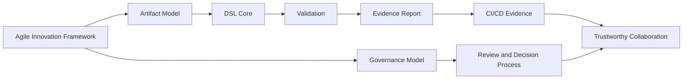
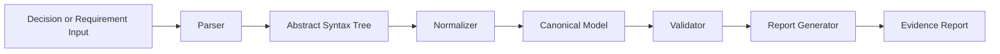
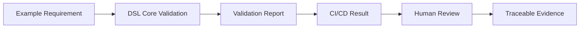

# DSL Core Integration

## Purpose

This document explains how [**DSL Core**](https://github.com/rock-the-prototype/dsl-core) integrates within the [**Agile Innovation Framework (AIF)**](https://github.com/Agile-Innovation/Agile-Innovation-Framework/)

The Agile Innovation Framework defines HOW trustworthy innovation should be organized, governed, reviewed, and continuously improved. 
DSL Core provides the technical foundation to make selected artifacts machine-readable, verifiable, reproducible, and auditable.

In short:

> **AIF** defines the **large-scale agile collaboration model**. 
> **DSL Core** provides the verification core. *Iterative Prototyping* delivers the constant proof.

This integration model describes how both artifacts complement each other and how contributors, adopters, reviewers, and domain experts should collaborate in a transparent and evidence-oriented way.

---

## Strategic Relationship

The Agile Innovation Framework and DSL Core address different but complementary layers.

| Layer                      | Primary Role                            | Main Question                                                                       |
| -------------------------- | --------------------------------------- | ----------------------------------------------------------------------------------- |
| Agile Innovation Framework | Method, governance, collaboration model | How do people effectivly work together in a trustworthy way?                        |
| DSL Core                   | Formalization and validation engine     | How can artifacts be checked for standards, it security, consistency, and quality?  |
| Prototyping                | Practical proof and learning loop       | How can assumptions be tested early and visibly?                                    |
| Evidence Reports           | Reproducible validation output          | What was checked, with which result, and why?                                       |

The goal is to make collaboration more transparent, based on structured and verified process models, and verifiable output.

---

## Why DSL Core improves your work within your organisation  

The **Agile Innovation Framework** provides an agile operating model for trustworthy collaboration.

**DSL Core** provides a concrete mechanism to transform important project artifacts into structured, validated, and reviewable evidence.

Together, they enable a development approach where decisions, requirements, rules, and validation results are:

* structured,
* versioned,
* reviewed,
* validated,
* traceable,
* reproducible,
* and understandable for different stakeholders.

This creates a powerfull foundation for collaboration based visible process quality and verifiable artifacts.

---

## Guiding Principle

> **If an artifact is important for trust, quality, security, compliance, or decision-making, it MUST become explicit, structured, versioned, and verifiable.**

This does not mean that every conversation, idea, or draft must be formalized.

It means that *critical artifacts* MUST move from informal text toward structured evidence whenever they influence it architecture, it security, requirements, compliance, delivery, or accountability.

---

## Why DSL Core Belongs to the Agile Innovation Framework

Modern software and digital infrastructure projects often fail because critical *knowledge remains implicit*.

Requirements are ambiguous. Decisions are scattered. IT Architecture assumptions are undocumented. Security expectations are described too late. Compliance evidence is collected after the fact.

The Agile Innovation Framework addresses this by defining a collaborative and governance-oriented model for innovation.

DSL Core adds the missing technical mechanism:

> It enables selected artifacts to become machine-readable, validated, and reproducible evidence.

This connects agile collaboration with technical accountability.

---

## Integration Overview

The Agile Innovation Framework defines the collaborative and governance context.

DSL Core validates whether selected artifacts follow the expected structure, rules, and quality criteria.

The generated reports make validation results explicit and reproducible.

---

## Artifact Classes

The integration between AIF and DSL Core starts with clearly defined *artifact classes*.

An artifact class describes a type of artifact that is important within your organisation - these artifacts need to be machine-readable, structured, reviewed, and validated.

Examples include:

| Artifact Class               | Description                                                                     |
| ---------------------------- | ------------------------------------------------------------------------------- |
| Requirement Atom             | The smallest independently meaningful and testable requirement unit             |
| Architecture Decision Record | A documented decision with context, rationale, and consequences                 |
| Security Control             | A security-related rule, expectation, or control objective                      |
| Compliance Evidence          | Evidence used to support regulatory, contractual, or audit-related expectations |
| Validation Rule              | A formal rule used by DSL Core to evaluate an artifact                          |
| Schema Contract              | A structural contract that defines the expected shape of an artifact            |
| Report Contract              | A contract that defines the structure and semantics of validation outputs       |
| Risk or Assumption Record    | A documented uncertainty, risk, or assumption requiring transparency            |
| Interface or API Requirement | A structured expectation for interfaces, APIs, or integration points            |

### Don't know where to start?
Bet for sure: You'll never start with completness!
Best Practice is to introduce these classes incrementally. Step by Step.

**Get familiare with agile mindset and agile methods!**

The first priority is a small, working, understandable, and validated vertical slice.
Start with a with an initial analysis. 
Prioritize relevant processes and artifacts. 
Start with the top 3.
Now!

---

## Requirement Atoms

A core concept is the **Requirement Atom**.

A Requirement Atom is the smallest independently meaningful requirement unit that can be reviewed, validated, and tested in isolation.

A good Requirement Atom MUST be:

* explicit,
* understandable,
* atomic,
* testable,
* traceable,
* and stable enough to be reviewed.

DSL Core can help evaluate whether a requirement follows a defined structure and whether it contains enough information to support validation, implementation, and review.

The goal is not to force all requirements into a rigid format.

The goal is to make important requirements precise enough to support shared understanding and reproducible validation.

---

## DSL Core Processing Model

DSL Core follows a processing model that separates parsing, normalization, validation, and reporting.

### Parser

The parser reads the input and transforms it into a structured representation.

Its responsibility is syntax recognition.

It MUST answer:

* Can the input be parsed?
* Which structure can be extracted?
* Where are syntax-level problems located?

### Abstract Syntax Tree

The Abstract Syntax Tree represents the parsed structure.

It is a technical intermediate representation.

### Normalizer

The normalizer transforms parsed input into a canonical form.

Its responsibility is consistency.

It should answer:

* Are equivalent inputs represented consistently?
* Can the artifact be compared, reviewed, and processed deterministically?
* Does the artifact follow a stable canonical representation?

### Validator

The validator applies defined rules to the canonical model.

Its responsibility is quality, consistency, and meaning.

It should answer:

* Does the artifact satisfy the defined schema?
* Does it follow semantic rules?
* Is it atomic enough?
* Is it testable?
* Is it complete enough for its intended purpose?

### Report Generator

The report generator produces a deterministic validation result.

Its responsibility is evidence.

It MUST answer:

* What was checked?
* Which rules were applied?
* What passed?
* What failed?
* Where did it fail?
* Which exit code or severity applies?
* What should be improved?

---

## Validation Scope

DSL Core supports different validation layers.

| Validation Layer        | Purpose                                                                         |
| ----------------------- | ------------------------------------------------------------------------------- |
| Syntax Validation       | Checks whether the input follows the expected grammar or structure              |
| Schema Validation       | Checks whether required fields and structures exist                             |
| Rule Validation         | Checks semantic quality and consistency                                         |
| Atomicity Validation    | Checks whether an artifact is sufficiently focused and independently meaningful |
| Testability Validation  | Checks whether an artifact can support verification or acceptance testing       |
| Traceability Validation | Checks whether relations to other artifacts are explicit                        |
| Report Validation       | Checks whether generated outputs follow the expected report contract            |

This layered model is important because different failures have different meanings.

A syntax error is different from a weak requirement. A missing field is different from an unclear decision. A structural issue is different from a semantic quality issue.

---

## Governance Rule for Normative Artifacts

Any artifact that is considered normative within the **Agile Innovation Framework** should be subject to a transparent change process.
If you follow this principle, you'll empower your organisation and your performance in competition. Your're simply better than organisations lacking trusted artifacts.

This applies especially to:

* schemas,
* validation rules,
* report contracts,
* artifact class definitions,
* governance rules,
* role definitions,
* decision rules,
* and quality gates.

A change to such an artifact MUST include:

1. an issue or proposal,
2. a clear rationale,
3. at least one example,
4. at least one test or validation case,
5. review by an appropriate role,
6. a documented decision,
7. and a traceable change in Git.

This creates a transparent path from idea to validated artifact.

---

## Git as the Normative Source of Truth

For the current stage, Git should remain the normative source of truth.

This means:

* artifacts are stored in Git,
* changes are reviewed through pull requests,
* history remains traceable,
* validation can run in CI/CD,
* generated reports can be reproduced,
* and decisions can be linked to commits, issues, and discussions.

A future platform may provide a user interface, visualization, collaboration workflows, or dashboards.

However, at the foundation level, the platform should not become a second source of truth.

The platform should initially act as a usability and projection layer on top of Git-based artifacts.

This keeps the model simple, transparent, and auditable.

---

## Evidence-Oriented Collaboration

The integration model is based on **evidence-oriented collaboration**.

This means that contributors should increasingly provide artifacts that can be reviewed, tested, validated, or challenged.

Examples:

| Contribution Type   | Expected Evidence                                               |
| ------------------- | --------------------------------------------------------------- |
| New artifact class  | Definition, example, validation idea                            |
| New validation rule | Rule description, positive example, negative example, test case |
| Schema change       | Rationale, compatibility impact, sample artifact                |
| Report change       | Output contract, example report, consumer impact                |
| Governance change   | Decision rationale, role impact, review expectation             |
| Architecture change | ADR, trade-off analysis, validation impact                      |

This approach supports transparency without slowing down experimentation.

The framework should remain iterative, but important decisions should leave an evidence trail.

---

## Roles

The integration between AIF and DSL Core requires clear but lightweight roles.

| Role               | Responsibility                                                                   |
| ------------------ | -------------------------------------------------------------------------------- |
| Maintainer         | Protects coherence, roadmap, quality, and repository integrity                   |
| Contributor        | Proposes improvements, examples, rules, documentation, or implementation changes |
| Reviewer           | Reviews changes for clarity, consistency, and impact                             |
| Domain Expert      | Provides domain-specific knowledge and validates practical relevance             |
| Technical Expert   | Reviews implementation, automation, tooling, and architecture aspects            |
| Auditor / Observer | Reviews whether evidence, traceability, and decisions are understandable         |
| Adopter            | Uses the framework or DSL Core in a practical context and provides feedback      |

A single person may hold multiple roles in an early-stage project.

As adoption grows, the model should evolve toward clearer separation of responsibilities.

---

## Decision Rights

Not every change requires the same level of review.

The decision model should distinguish between different types of changes.

| Change Type                               | Suggested Decision Approach                             |
| ----------------------------------------- | ------------------------------------------------------- |
| Typo, formatting, small documentation fix | Lightweight maintainer review                           |
| Example improvement                       | Contributor proposal and reviewer approval              |
| New artifact class                        | Issue, rationale, examples, maintainer decision         |
| New validation rule                       | Proposal, examples, tests, technical review             |
| Schema contract change                    | Compatibility review and maintainer decision            |
| Report contract change                    | Consumer impact review and documented decision          |
| Governance model change                   | Broader review and explicit decision record             |
| Breaking change                           | Dedicated proposal, migration note, versioning decision |

The goal is to keep contribution easy while protecting the integrity of normative artifacts.

---

## Minimal Vertical Slice

The next practical milestone should be a minimal vertical slice.

It should demonstrate the complete path from input to evidence.

The vertical slice should include:

1. one simple artifact class,
2. one valid example,
3. one invalid example,
4. one schema or grammar rule,
5. one semantic validation rule,
6. one deterministic report,
7. one CI/CD validation step,
8. and one documented connection to the Agile Innovation Framework.

Once you have realized these principles and put them into practice you'll notice the proof of how valuable they are.

It gives contributors a concrete collaboration mode to run, inspect, challenge, and improve.

---

## Onboarding Model

The integration supports different onboarding levels.

| Onboarding Level  | Goal                | Expected Result                                                                                  |
| ----------------- | ------------------- | ------------------------------------------------------------------------------------------------ |
| 5 minutes         | Understand the idea | You understand the goals of AIF, DSL Core, and their relationship                                |
| 15 minutes        | Run an example      | You can validate a sample artifact                                                               |
| 60 minutes        | Modify and learn    | You can change an artifact and understand the validation result                                  |
| Half day          | Contribute          | You can open an issue or pull request with an example, rule, or documentation improvement        |
| Contributor level | Co-create           | You in an active contributor can extend artifact classes, rules, tests, or reports responsibly   |

A new contributor should be able to start with one command, one example, and one visible result.

---

## Collaboration Principles

The integration follows these collaboration principles:

### 1. Make important things explicit

Implicit knowledge creates friction, misunderstanding, and avoidable risk.

Important expectations should become visible artifacts.

### 2. Prefer small validated increments

A small working validation flow is more valuable than a broad but untested concept.

### 3. Separate method from mechanism

AIF defines the collaboration and governance model.

DSL Core provides the validation mechanism.

### 4. Keep Git as the foundation

Git provides versioning, traceability, review, and reproducibility.

### 5. Treat reports as evidence

Validation reports should be deterministic, machine-readable, and understandable.

### 6. Design for human judgment

Validation supports humans. It does not replace expert review.

### 7. Make onboarding practical

A contributor should be able to understand, run, and improve something quickly.

---
