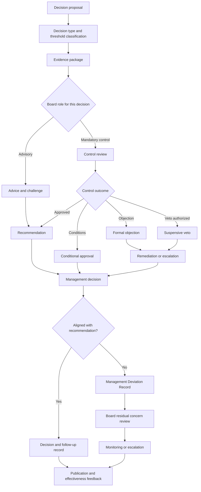

# Digital Advisory Board

## Definition

The Digital Advisory Board is a **multidisciplinary governance body** that provides independent, evidence-based advice, challenge, review, and, where explicitly authorized, control over strategically or operationally significant digital decisions within the Agile Innovation Framework.
A governance body is a formally established organizational unit with a defined mandate, composition, authority, responsibilities, decision procedures, and accountability for directing, overseeing, reviewing, or controlling a specified area of organizational activity.

It supports accountable management by integrating expertise across strategy, product, it architecture, technology, data, security, compliance, operations, stakeholder impact, and digital sovereignty.

The Digital Advisory Board does not replace executive management, statutory bodies, product ownership, architecture ownership, compliance functions, or operational accountability. It strengthens the quality, transparency, traceability, and defensibility of their decisions.

---

## Purpose

The purpose of the **Digital Advisory Board** is to improve the quality and trustworthiness of digital decision-making by ensuring that relevant decisions:

* are informed by appropriate multidisciplinary expertise
* are based on sufficient and reviewable evidence
* reflect strategic, technical, operational, legal, security, financial, and stakeholder implications
* make assumptions, alternatives, dependencies, risks, and trade-offs explicit
* remain aligned with organizational purpose, public interest, digital sovereignty, and long-term viability
* include independent challenge where execution and decision interests may conflict
* remain transparent, traceable, reviewable, and open to escalation

The Digital Advisory Board provides a structured interface between innovation, management, implementation, independent control, and affected stakeholders.

---

## Mandate

The mandate of the Digital Advisory Board MUST be defined in a version-controlled Board Charter.

The Board Charter MUST define at least:

* organizational scope
* decision areas covered
* advisory responsibilities
* control responsibilities
* decision, objection, escalation, and veto rights
* appointment authority
* reporting line
* required expertise
* membership terms
* quorum and voting rules
* conflict-of-interest rules
* evidence requirements
* confidentiality and publication rules
* escalation paths
* review frequency

The mandate SHOULD apply to an organization, program, portfolio, platform, product family, service domain, or defined digital ecosystem.

The Digital Advisory Board SHOULD be involved where decisions create significant:

* strategic impact
* investment or resource impact
* architectural impact
* cybersecurity or resilience impact
* data protection or data governance impact
* legal or regulatory impact
* operational or service continuity impact
* stakeholder or public impact
* interoperability or vendor dependency
* digital sovereignty impact
* ethical, social, accessibility, or sustainability impact

The Digital Advisory Board MUST NOT assume responsibilities that legally or organizationally belong to a statutory governing body, supervisory authority, accountable executive, data protection officer, information security officer, audit function, or other formally designated role.

---

## Relationship to Other AIF Governance Artifacts

This artifact complements:

* [Governance & Accountability Model](./Governance_and_Accountability_Model.md)
* [Role, Function and Permission Model](./Role_Function_and_Permission_Model.md)
* [Decision Rights and RACI Model](./Decision_Rights_and_RACI_Model.md)

The Role, Function and Permission Model defines which roles and capabilities exist and what they are permitted to do.

The Decision Rights and RACI Model defines who proposes, contributes, reviews, approves, objects, escalates, arbitrates, and finally decides.

The Digital Advisory Board defines how a multidisciplinary governance body performs structured advice, independent challenge, control review, and escalation within those role and decision structures.

Every Digital Advisory Board activity MUST be connected to:

* a defined decision owner
* a defined accountable owner
* a defined decision type
* a defined authority level
* a documented evidence basis
* a defined escalation path
* a defined publication or confidentiality classification

---

## Core Principles

### 1. Expertise before authority

Board participation MUST be based on relevant expertise, experience, legitimacy, and independence. Roles need to be independed by organizational status.

### 2. Accountability remains explicit

The Board SHOULD advise, review, object, conditionally approve, escalate, or suspend a decision within its mandate.

Final accountability MUST remain assigned to exactly one defined accountable role or legally authorized governing body.

### 3. Independent challenge

The Board MUST be sufficiently independent to challenge management assumptions, delivery interests, architecture choices, evidence quality, accepted risks, and stakeholder impact.

### 4. No governance theatre

Board involvement MUST occur early enough to influence a decision. Late-stage presentation of effectively irreversible decisions MUST NOT be treated as meaningful consultation.

### 5. Evidence-based recommendations

Recommendations, objections, approvals, and vetoes MUST be based on documented evidence appropriate to the impact and risk of the decision.

### 6. Transparent divergence

Management MAY deviate from an advisory recommendation where it has the authority to do so, but the deviation MUST be explicit, justified, documented, and reviewable.

### 7. Proportionality

The depth of Board review MUST be proportionate to decision impact, uncertainty, irreversibility, public relevance, and risk.

### 8. Learning and evolution

The Board MUST review whether its recommendations and controls improve outcomes and MUST adapt its composition, methods, and mandate where evidence shows a need for change.

---

## Professional Composition

The Digital Advisory Board MUST have a multidisciplinary composition appropriate to its mandate.

The Board SHOULD normally comprise between five and eleven voting members. A different size MAY be used where the rationale, required expertise, and ability to operate effectively are documented.

The composition MUST collectively cover the following capability areas where relevant:

* digital strategy and organizational transformation
* product, service, or user value
* enterprise, solution, or software architecture
* technology engineering and implementation
* cybersecurity and operational resilience
* data governance, data protection, and information management
* legal, regulatory, and compliance expertise
* operations, service management, and continuity
* finance, investment, procurement, or commercial implications
* stakeholder, citizen, customer, employee, or public-interest perspectives
* accessibility, inclusion, ethics, and societal impact
* interoperability, open standards, vendor independence, and digital sovereignty
* sustainability and long-term maintainability

Not every capability area requires a permanent voting member. The Board MAY use non-voting experts, temporary reviewers, working groups, or invited stakeholders where specialist expertise is required.

The Board MUST maintain a documented competence matrix that identifies:

* required capability areas
* current member expertise
* identified capability gaps
* independence status
* term of appointment
* voting status
* relevant affiliations

At least one member MUST have sufficient architecture and technology expertise to evaluate technical feasibility and long-term coherence.

At least one member MUST have sufficient security, resilience, or compliance expertise to evaluate critical control and risk implications.

At least one member MUST represent affected users, stakeholders, or public-interest considerations where decisions materially affect them.

The Chair MUST possess governance competence and MUST be able to facilitate multidisciplinary challenge without suppressing minority opinions.

---

## Appointment and Removal

### Appointment authority

The authority that appoints Board members MUST be defined in the Board Charter.

Appointment decisions MUST be documented and MUST include:

* the capability or perspective represented
* the selection criteria used
* the member's independence classification
* relevant affiliations and interests
* the term of appointment
* voting rights
* any restrictions or recusals known at appointment

Appointments MUST NOT be based solely on hierarchical position, personal loyalty, or sponsorship by the decision owners subject to Board review.

### Selection process

The appointment process SHOULD include:

* a documented capability need
* transparent eligibility criteria
* assessment of expertise and experience
* assessment of independence
* conflict-of-interest disclosure
* confirmation of available capacity
* acceptance of confidentiality and transparency obligations
* approval by the defined appointment authority

For high-impact, publicly funded, or sovereignty-critical contexts, the organization SHOULD include an open nomination, stakeholder nomination, or independent selection element.

### Terms

Membership terms SHOULD be time-limited and staggered to preserve both independence and continuity.

The Board Charter MUST define:

* standard term length
* renewal limits
* succession rules
* temporary replacement rules
* handover obligations

Automatic or indefinite renewal SHOULD be avoided.

### Removal

A member MAY be removed before the end of the term only on documented grounds.

Grounds MAY include:

* loss of required independence
* unresolved or concealed conflict of interest
* serious breach of confidentiality
* repeated failure to participate
* misconduct
* material breach of the Board Charter
* loss of required professional suitability
* inability to perform the role

Removal MUST NOT be used to suppress dissent, critical review, formal objection, minority opinion, or an inconvenient recommendation made in good faith.

The removal decision MUST identify:

* the authority making the decision
* the grounds
* the evidence considered
* whether the member was heard
* the effective date
* the replacement or continuity arrangement

Where the removed member alleges retaliation or interference with independence, the matter MUST be eligible for escalation to an authority outside the management scope directly affected by the Board's review.

---

## Independence

The Digital Advisory Board MUST be structurally, procedurally, and intellectually capable of independent challenge.

Independence does not require every member to be external. It requires that the Board as a whole can review decisions without being controlled by the people who sponsor, implement, or benefit directly from those decisions.

### Structural independence

The Board MUST have:

* a reporting line defined outside the delivery team for matters under review
* direct access to the accountable authority within its mandate
* the right to request relevant evidence
* the right to record unresolved concerns
* the right to escalate interference, withheld information, or ignored control findings
* access to independent expertise where internal expertise is insufficient or conflicted

A majority of voting members SHOULD NOT hold direct delivery accountability for the matters routinely reviewed by the Board.

The Chair MUST NOT be the accountable owner, decision owner, implementation owner, or commercial sponsor of a matter under review.

### Procedural independence

The Board MUST control or approve its own:

* review agenda within the defined mandate
* requests for evidence
* meeting records
* recommendation wording
* dissenting opinions
* escalation notices
* effectiveness reports

Management MAY request a review but MUST NOT alter the Board's final recommendation or suppress a documented minority position.

### Intellectual independence

Members MUST be free to:

* challenge assumptions
* request alternatives
* question evidence quality
* identify uncertainty
* raise ethical or public-interest concerns
* disagree with management or other members
* record minority opinions
* request escalation

Performance evaluation, compensation, contract renewal, or organizational position MUST NOT be used to influence a member's professional judgment.

---

## Conflicts of Interest

Every member, invited expert, observer, and secretariat participant MUST disclose actual, potential, and perceived conflicts of interest.

Conflicts MAY arise from:

* financial interests
* employment or reporting relationships
* supplier, vendor, or consultancy relationships
* implementation responsibility
* ownership of the proposal under review
* personal or family relationships
* political, institutional, or professional affiliations
* prior public commitments that materially impair impartiality
* intellectual property interests
* competing mandates or fiduciary duties

### Conflict register

The Board MUST maintain a conflict-of-interest register containing:

* declared interest
* affected scope
* date of declaration
* assessment
* mitigation
* recusal requirement
* review date

The register SHOULD be available to relevant stakeholders and MAY be published with proportionate redaction of personal or legally protected information.

### Meeting-specific declaration

Conflicts MUST be declared:

* at appointment
* at least annually
* when circumstances change
* at the beginning of each meeting
* before participation in a newly arising matter

### Mitigation

Depending on severity, mitigation MAY include:

* transparent declaration without restriction
* limitation to factual contribution
* exclusion from deliberation
* exclusion from voting
* temporary recusal
* appointment of an independent reviewer
* removal from the Board

A conflicted member MUST NOT vote on a matter where the conflict could reasonably affect impartial judgment.

Recusal and its effect on quorum MUST be recorded in the minutes.

Failure to disclose a material conflict MUST trigger review of the affected recommendation or decision.

---

## Advisory and Control Functions

The Board Charter MUST distinguish the Board's advisory function from its control function.

The distinction MUST be defined for each decision area rather than assumed from the Board's name.

### Advisory function

In its advisory function, the Board MAY:

* provide recommendations
* identify opportunities and risks
* challenge assumptions
* propose alternatives
* request additional analysis
* identify capability or evidence gaps
* recommend conditions
* recommend escalation
* publish a professional opinion

Advisory recommendations are not binding unless another governance rule explicitly gives them binding effect.

Management remains accountable for the final decision and MUST respond to material recommendations.

### Control function

In its control function, the Board MAY, where explicitly authorized:

* perform mandatory review
* verify evidence completeness
* assess compliance with defined principles or thresholds
* issue a formal objection
* require remediation before a gate proceeds
* issue conditional approval
* suspend a decision or release through a defined veto right
* escalate unresolved control findings
* require follow-up evidence

A control function MUST have:

* a defined legal or governance basis
* a defined scope
* defined decision thresholds
* defined evidence requirements
* defined response deadlines
* defined escalation paths
* defined override rules
* defined accountability for final resolution

The Board MUST NOT claim a control power that has not been explicitly delegated.

---

## Decision, Objection, and Veto Rights

The Digital Advisory Board MAY hold different rights for different decision categories.

The Board Charter MUST map its rights to the decision-right definitions of the AIF Decision Rights and RACI Model.

### Review right

The Board MAY review proposals, alternatives, assumptions, risks, evidence, architecture decisions, investment decisions, operational readiness, and stakeholder impact.

### Recommendation right

The Board MAY issue a documented recommendation to:

* approve
* approve with conditions
* revise
* defer
* reject
* escalate
* commission additional evidence

A recommendation MUST identify whether it is advisory or part of a mandatory control process.

### Objection right

A formal objection means that the Board has identified a material unresolved concern.

An objection MUST:

* state the concern
* identify the affected requirement, principle, threshold, or risk
* reference the evidence considered
* define required resolution or escalation
* identify whether work may continue pending resolution

A formal objection MUST be addressed before final approval where the applicable governance model requires Board consultation or control review.

### Conditional approval

The Board MAY issue conditional approval where identified concerns can be resolved through explicit, measurable, and time-bound conditions.

Conditional approval MUST define:

* each condition
* accountable owner
* due date
* required evidence
* verification authority
* consequence of non-fulfilment

### Veto right

A veto MUST be exceptional, explicit, limited, and reviewable.

The Board MAY exercise a veto only where the Board Charter or another binding governance rule grants that authority for a defined decision category.

A veto SHOULD normally be suspensive rather than substitutive. It pauses approval, release, investment, or implementation until the issue is resolved or escalated, but does not transfer final management accountability to the Board.

A veto MAY be used where:

* mandatory evidence is missing or materially unreliable
* a defined legal, regulatory, security, privacy, resilience, architecture, sovereignty, or ethical threshold is breached
* required independent review has not occurred
* a material conflict of interest invalidates the decision process
* decision authority has been exceeded
* an irreversible or high-impact decision lacks adequate alternatives or risk analysis
* a previously imposed critical condition remains unfulfilled

A veto MUST include:

* scope
* rationale
* evidence
* triggering threshold
* required remediation
* accountable resolution owner
* escalation authority
* review date
* conditions for lifting the veto

A veto MUST NOT be used to impose personal preference, protect organizational territory, delay competition, or replace management judgment on matters outside the Board's mandate.

Where a veto is overridden, the override MUST follow the management deviation process defined below.

No override is permitted where the proposed action would violate applicable law or a binding decision of a competent authority.

---

## Decision Categories and Baseline Board Rights

The following mapping provides a reusable baseline. Organizations MUST adapt it to their authority structure and risk model.

| Decision category                               | Advisory review |                          Mandatory review | Objection right |                                                  Suspensive veto | Final decision authority                       |
| ----------------------------------------------- | --------------: | ----------------------------------------: | --------------: | ---------------------------------------------------------------: | ---------------------------------------------- |
| Digital strategy and target architecture        |             Yes |                      For critical changes |             Yes |                                       Where explicitly delegated | Accountable strategic authority                |
| Major digital investment                        |             Yes |                   Above defined threshold |             Yes |                      Where evidence or authority thresholds fail | Accountable investment authority               |
| Architecture exceptions                         |             Yes |    For significant or critical exceptions |             Yes |                 For prohibited or critical unresolved deviations | Defined architecture or governance authority   |
| Cybersecurity and resilience risk               |             Yes |              For critical risk acceptance |             Yes |                    For mandatory-control failure where delegated | Authorized risk acceptance authority           |
| Data protection and data governance             |             Yes |  For high-impact processing or exceptions |             Yes |                 Where action would breach mandatory requirements | Authorized accountable authority               |
| Vendor lock-in and sovereignty risk             |             Yes |        Above defined dependency threshold |             Yes |                Where delegated for critical sovereignty controls | Accountable procurement or strategic authority |
| Production release or operational readiness     |        Optional | For critical services or exceptional risk |             Yes |                        Where release-gate authority is delegated | Accountable service or release authority       |
| AI or automated decision systems                |             Yes |                       For high-impact use |             Yes | Where mandatory safeguards are absent and authority is delegated | Accountable business or statutory authority    |
| Public-interest or stakeholder-impact decisions |             Yes |              Where material impact exists |             Yes |                         Normally no, unless explicitly delegated | Accountable management or statutory body       |

The Board MUST NOT be listed as final decision authority unless the organization's governance model deliberately establishes it as a formally accountable decision body for that specific scope.

---

## Required Evidence

The Board MUST receive sufficient information to perform meaningful review.

Evidence requirements MUST be proportionate to decision impact and MUST be defined before the decision reaches the Board wherever feasible.

For significant and critical decisions, the evidence package SHOULD include:

### Decision context

* decision statement
* purpose and intended outcome
* scope and affected services
* accountable owner
* decision owner
* required decision date
* authority threshold

### Strategic and value evidence

* strategic alignment
* expected user, stakeholder, organizational, or public value
* measurable outcomes
* opportunity cost
* success criteria

### Options and alternatives

* options considered
* status quo option
* reasons for rejecting alternatives
* reversibility assessment
* exit or migration options

### Architecture and technology evidence

* architecture impact
* interoperability implications
* dependency analysis
* technical feasibility
* maintainability and lifecycle impact
* standards alignment
* technical debt implications
* vendor dependency and lock-in analysis
* digital sovereignty implications

### Security, privacy, and compliance evidence

* risk assessment
* threat or misuse analysis where relevant
* security controls
* resilience and continuity impact
* data protection impact
* legal and regulatory assessment
* exceptions and residual risk
* independent review results where required

### Delivery and operations evidence

* delivery approach
* resource and capability requirements
* test and validation strategy
* operational readiness
* monitoring and observability
* incident and recovery provisions
* rollback, fallback, or exit strategy
* service-level implications

### Financial and commercial evidence

* cost estimate
* lifecycle cost
* funding source
* procurement implications
* contractual dependencies
* supplier incentives and risks
* benefit assumptions

### Stakeholder and societal evidence

* affected stakeholder groups
* consultation performed
* objections or concerns
* accessibility and inclusion impact
* ethical or societal impact
* distribution of benefits and burdens

### Governance evidence

* required approvals
* conflicts of interest
* prior Board recommendations
* unresolved conditions
* deviations from applicable principles or policies
* proposed risk acceptance
* review and expiration dates

The Board MAY request additional evidence where the submitted package is insufficient.

The Board MUST distinguish:

* verified facts
* estimates
* assumptions
* professional judgments
* unresolved uncertainties

Missing evidence MUST NOT automatically be interpreted as evidence of low risk.

---

## Recommendation Record

Every material Board recommendation MUST be documented in a structured Recommendation Record.

The record MUST include:

* unique identifier
* title and decision category
* date
* scope
* accountable owner
* decision owner
* Board role: advisory or control
* participating members
* recusals and conflicts
* evidence reviewed
* material assumptions
* relevant alternatives
* identified benefits
* identified risks
* stakeholder impact
* recommendation
* conditions
* objection or veto status
* vote or consensus outcome
* dissenting opinions
* required management response
* follow-up date
* publication classification

The recommendation MUST state one of the following outcomes:

* support
* support with conditions
* revise and resubmit
* defer pending evidence
* do not support
* formal objection
* suspensive veto
* escalate

Recommendations MUST be written clearly enough that an independent reviewer can understand what was advised, why, and on what evidence.

---

## Transparency of Recommendations

Board recommendations MUST be visible to the roles affected by or accountable for the decision.

The organization MUST maintain a Board Recommendation Register containing at least:

* recommendation identifier
* subject
* date
* recommendation status
* management decision
* open conditions
* accountable owner
* follow-up status
* publication classification

Recommendations SHOULD be transparent by default.

Publication MAY be restricted or redacted only where necessary to protect:

* personal data
* security-sensitive information
* legally protected confidentiality
* trade secrets
* procurement integrity
* legitimate contractual confidentiality
* privileged legal advice

Restrictions MUST be proportionate and MUST NOT be used to conceal poor governance, unresolved risk, disagreement, or management deviation.

Where full publication is not possible, a meaningful summary SHOULD be published that preserves:

* the subject
* the recommendation
* the principal rationale
* the decision status
* the existence of material dissent or unresolved concern

For publicly funded, public-sector, or high-public-impact decisions, external publication SHOULD be the default unless a documented legitimate restriction applies.

---

## Management Decisions That Deviate from Board Recommendations

Management retains decision authority where the Board acts in an advisory capacity.

Where management decides differently from a material Board recommendation, it MUST create a Management Deviation Record.

The record MUST include:

* recommendation identifier
* final management decision
* accountable decision maker
* reasons for deviation
* evidence considered
* benefits expected from the deviation
* risks introduced or retained
* affected stakeholders
* compensating controls
* risk acceptance authority
* time limitation or review date
* implementation monitoring
* publication classification

The management response MUST address each material Board concern rather than merely state disagreement.

The Board MUST have the right to:

* review the deviation rationale
* record whether its concern is resolved, mitigated, or unresolved
* issue a residual concern statement
* request additional monitoring
* escalate where authority, legal, security, compliance, or risk thresholds are exceeded

A management deviation MUST NOT retrospectively alter or delete the original Board recommendation.

Where management repeatedly overrides recommendations in the same risk area, the pattern MUST trigger a governance effectiveness review.

Where a deviation accepts significant or critical residual risk, the acceptance MUST be:

* explicit
* assigned to an authorized accountable role
* time-bound
* linked to monitoring
* subject to review

---

## Meetings, Quorum, and Voting

The Board Charter MUST define meeting frequency, quorum, voting rules, and urgent procedures.

The Board SHOULD meet at a frequency appropriate to the volume and significance of decisions.

A valid quorum MUST require:

* more than half of voting members
* participation of the Chair or defined deputy
* sufficient non-conflicted members
* representation of the capability areas material to the decision

A numerical quorum alone is insufficient where the expertise needed for the matter is absent.

The Board SHOULD seek reasoned consensus.

Where consensus is not reached, the outcome MUST record:

* votes for and against
* abstentions
* recusals
* minority opinions
* unresolved concerns

Proxy voting SHOULD NOT be permitted unless explicitly defined and accompanied by sufficient evidence that the proxy can exercise informed independent judgment.

Urgent decisions MAY use an expedited procedure, but MUST still preserve:

* authority clarity
* conflict disclosure
* sufficient evidence
* traceable outcome
* retrospective confirmation at the next regular meeting

---

## Minutes and Publication

Every formal Board meeting MUST be documented.

Minutes MUST include:

* date and format
* attendees and roles
* absences
* observers and invited experts
* quorum status
* conflict declarations and recusals
* agenda
* evidence submitted
* key questions and challenges
* recommendations and decisions
* conditions
* objections or vetoes
* voting outcome
* dissenting opinions
* action owners and deadlines
* escalation items
* publication classification

Minutes MUST distinguish discussion from formal recommendation or decision.

Minutes MUST NOT be edited to remove material disagreement after approval.

Draft minutes SHOULD be circulated within a defined documentation service level and SHOULD normally be available within ten working days.

Corrections MUST remain traceable.

Approved minutes, recommendation records, and management responses MUST be stored in a version-controlled or otherwise tamper-evident repository with appropriate access control and retention.

Publication MUST follow the transparency rules defined above.

---

## Secretariat and Operational Support

The Board SHOULD have a designated secretariat or coordination function.

The secretariat MAY:

* coordinate agendas
* verify document completeness
* maintain registers
* organize meetings
* record minutes
* track actions and conditions
* support publication
* monitor terms and conflict declarations
* prepare effectiveness data

The secretariat MUST NOT alter recommendations, suppress dissent, or determine substantive outcomes.

The secretariat SHOULD be organizationally positioned so that it can support the Board without being controlled by the delivery function most frequently subject to review.

---

## Escalation

The Board MUST have defined escalation paths for:

* missing or withheld evidence
* interference with independence
* unresolved conflicts of interest
* ignored formal objections
* attempted circumvention of mandatory review
* authority breaches
* unfulfilled critical conditions
* repeated management deviations
* critical residual risk
* legal, regulatory, security, or public-interest concerns

Escalation MAY lead to:

* accountable executive review
* independent control review
* audit review
* legal or compliance review
* arbitration
* statutory body review
* supervisory or regulatory notification where legally required

Escalation MUST be documented and MUST identify the authority expected to resolve the matter.

---

## Confidentiality, Access, and Protected Information

Board members MUST receive access to the information required to perform their mandate.

Access MUST follow least-privilege, need-to-know, data protection, and security requirements.

Confidentiality obligations MUST NOT prevent members from reporting concerns through authorized escalation, whistleblowing, audit, legal, regulatory, or supervisory channels.

The Board MUST define how it handles:

* personal data
* classified or security-sensitive information
* commercial confidentiality
* legal privilege
* procurement-sensitive information
* third-party confidential information
* information subject to publication obligations

Confidentiality classifications and redactions MUST be documented.

---

## Regular Effectiveness Review

The Digital Advisory Board MUST review its effectiveness at least annually.

A more frequent review SHOULD occur during initial establishment, major organizational change, or periods of significant digital transformation.

An additional review MUST be triggered by events such as:

* major incident or control failure
* significant regulatory finding
* repeated bypass of Board review
* repeated management overrides
* undisclosed conflict of interest
* material failure of a Board-approved decision
* persistent evidence-quality problems
* loss of required expertise or independence
* stakeholder concern regarding legitimacy or transparency

### Review dimensions

The effectiveness review MUST assess:

* whether the mandate remains appropriate
* whether required expertise is present
* whether members are sufficiently independent
* whether conflicts are identified and managed
* whether evidence is timely and sufficient
* whether reviews occur early enough to influence decisions
* whether recommendations are clear and actionable
* whether conditions are tracked and fulfilled
* whether management responses are complete
* whether unresolved concerns are escalated
* whether publication is timely and meaningful
* whether the Board improves decision quality and risk outcomes
* whether the Board creates unnecessary delay or duplication
* whether stakeholder perspectives are adequately represented
* whether dissenting opinions are protected

### Effectiveness indicators

The organization SHOULD monitor indicators such as:

* number and type of matters reviewed
* review lead time
* percentage of evidence packages accepted as complete
* recommendation adoption rate
* conditional approval closure rate
* number of formal objections and vetoes
* number and pattern of management deviations
* age of unresolved conditions
* recurrence of previously identified issues
* incidents linked to Board-reviewed decisions
* stakeholder and management feedback
* member participation and recusal rates
* expertise gaps
* publication timeliness

Metrics MUST NOT be used to reward low objection rates, rapid approval, or management alignment at the expense of independent judgment.

### Independent assessment

The Board SHOULD undergo an independent effectiveness assessment at least every three years or after a major governance failure.

The assessor MUST be sufficiently independent from the Board, management, and delivery functions under review.

### Improvement plan

The effectiveness review MUST result in:

* findings
* agreed improvement actions
* accountable owners
* deadlines
* follow-up status
* changes to the Board Charter where required

A summary of the review and improvement actions SHOULD be published subject to legitimate confidentiality restrictions.

---

## Minimum Required Artifacts

An organization operating a Digital Advisory Board MUST maintain at least:

* Board Charter
* member and competence register
* appointment and term records
* conflict-of-interest register
* decision-rights mapping
* annual agenda or review plan
* evidence requirements
* meeting minutes
* Recommendation Register
* Management Deviation Register
* condition and action tracker
* escalation records
* annual effectiveness review

These artifacts MUST be versioned, traceable, access-controlled, and retained according to defined governance and legal requirements.

---

## Minimal Viable Digital Advisory Board

An organization MAY begin with a minimal viable Digital Advisory Board where complexity and risk are limited.

The minimum viable model MUST still include:

* a documented mandate
* at least three distinct capability perspectives
* a defined accountable authority
* explicit advisory and control boundaries
* conflict-of-interest disclosure
* evidence-based recommendations
* documented management responses
* meeting or review records
* escalation rights
* annual effectiveness review

A minimal Board MUST NOT be used to justify insufficient independence or missing expertise for critical decisions.

As impact, complexity, regulation, stakeholder relevance, or risk increases, the Board MUST evolve accordingly.

---

## Digital Advisory Board Review Flow



---

## Board Charter Template

```markdown
# Digital Advisory Board Charter

## Organizational Scope
[Organization, program, portfolio, platform, product, or service scope]

## Purpose and Mandate
[Why the Board exists and what it covers]

## Decision Categories
[Decisions subject to advisory or mandatory review]

## Rights
- Review:
- Recommendation:
- Objection:
- Conditional approval:
- Suspensive veto:
- Escalation:

## Final Decision Authorities
[Mapping of decision categories to accountable authorities]

## Composition
- Required capabilities:
- Number of voting members:
- External or independent members:
- Chair requirements:
- Invited experts:

## Appointment and Terms
- Appointment authority:
- Selection process:
- Term length:
- Renewal limit:
- Removal process:

## Independence
[Reporting line, access rights, protection from interference]

## Conflicts of Interest
[Disclosure, register, recusal, review]

## Evidence Requirements
[Required evidence by decision category and threshold]

## Meetings and Quorum
[Frequency, quorum, voting, urgent process]

## Transparency and Publication
[Registers, publication defaults, restrictions, redaction]

## Management Deviations
[Required response, risk acceptance, follow-up, escalation]

## Records and Retention
[Minutes, recommendation records, storage, retention]

## Effectiveness Review
[Frequency, indicators, independent review, improvement process]
```

---

## Recommendation Record Template

```markdown
# Digital Advisory Board Recommendation

## Metadata
- Recommendation ID:
- Date:
- Decision category:
- Advisory or control function:
- Accountable owner:
- Decision owner:

## Participants
- Voting members:
- Invited experts:
- Conflicts and recusals:

## Decision Under Review
[Decision statement, purpose, scope, and authority threshold]

## Evidence Reviewed
[List of evidence artifacts]

## Findings
- Strategic and value findings:
- Architecture and technology findings:
- Security, privacy, and compliance findings:
- Operational findings:
- Financial and commercial findings:
- Stakeholder and public-interest findings:
- Uncertainties and evidence gaps:

## Recommendation
[Support / Support with conditions / Revise and resubmit / Defer / Do not support / Formal objection / Suspensive veto / Escalate]

## Conditions or Required Actions
| Action | Accountable owner | Due date | Evidence required | Verification authority |
|---|---|---|---|---|

## Voting and Dissent
- Result:
- Abstentions:
- Minority opinions:

## Management Response Required By
[Date]

## Follow-up Date
[Date]

## Publication Classification
[Public / Internal / Restricted / Confidential, with rationale]
```

---

## Management Deviation Record Template

```markdown
# Management Deviation from Digital Advisory Board Recommendation

## Metadata
- Deviation ID:
- Recommendation ID:
- Date:
- Accountable decision maker:

## Final Decision
[Decision taken]

## Reason for Deviation
[Why the recommendation was not followed]

## Evidence and Alternatives
[Evidence relied upon and alternatives considered]

## Risks and Stakeholder Impact
- New or retained risks:
- Affected stakeholders:
- Residual uncertainty:

## Compensating Controls
[Controls, monitoring, safeguards, or staged implementation]

## Risk Acceptance
- Authorized risk owner:
- Authority basis:
- Expiration or review date:

## Board Follow-up
- Board response:
- Residual concern:
- Escalation required:
- Monitoring requirements:

## Publication Classification
[Public / Internal / Restricted / Confidential, with rationale]
```

---


Following these organisational recommendations the Digital Advisory Board provides a soild trustfull and structured mechanism for multidisciplinary expertise, independent challenge, evidence-based recommendations, defined control rights, transparent management accountability, and continuous governance improvement.

Its value arises from clear mandate, qualified composition, protected independence, explicit decision rights, proportionate evidence, transparent recommendations, documented deviations, and measurable effectiveness.

Within the Agile Innovation Framework, the Digital Advisory Board enables innovation to remain agile while ensuring that high-impact digital decisions are professionally challenged, publicly defensible where required, and connected to explicit accountability.
