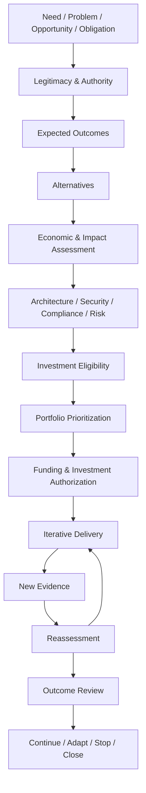

# Investment Decision Model

## Definition

The **Investment Decision Model** defines how the Agile Innovation Framework supports the requirement that investments within an organisation are justified, evaluated, authorized, reviewed, adapted, and terminated.

It provides a **transparent and evidence-based governance model** for decisions that commit relevant **financial, human, technical, operational, organizational, or other limited resources**.

The model ensures that investment decisions are based as well on strategic attractiveness, technical feasibility as on organizational resources like available budget, or stakeholder preference.

Relevant investments MUST be supported by sufficient evidence that the organization:

* is authorized to pursue the intended initiative,
* has a relevant need or expected outcome,
* has considered reasonable alternatives,
* understands the expected costs, benefits, risks, constraints, and opportunity costs,
* has sufficient authority and resources to commit,
* can explain why the selected alternative is justified,
* defines how expected outcomes will be validated,
* and can reconsider the investment when material assumptions change.

The Investment Decision Model complements prioritization, portfolio steering, it architecture governance, compliance, it security, and delivery governance.

---

## Purpose

The purpose of the Investment Decision Model is to **enable organizations** to invest resources responsibly without turning innovation into a rigid approval process.

It establishes a reusable decision structure that connects:

* organizational mandate and legitimacy,
* strategic intent,
* expected outcomes,
* economic justification,
* alternatives,
* lifecycle costs,
* opportunity costs,
* resource and capacity constraints,
* architecture and technical feasibility,
* security and compliance,
* risks and uncertainty,
* stakeholder impact,
* investment authority,
* iterative delivery,
* outcome validation,
* and continuous reassessment.

The model is designed **for organizations of different sizes and sectors**.

Additional AIF profiles MAY define stricter requirements for regulated industries, publicly funded organizations, critical infrastructure, public administration, social insurance, healthcare, financial services, or other contexts with specific legal, financial, audit, procurement, or accountability obligations.

---

## Core Principle

> Investment governance MUST enable innovation while ensuring that relevant commitments of resources remain legitimate, justified, accountable, reviewable, and adaptable.

Investment governance within AIF follows a simple distinction:

> **Eligibility** determines whether an initiative may proceed.
> **Prioritization** determines whether it should proceed before competing initiatives.
> **Investment authorization** determines whether resources may actually be committed.
> **Outcome review** determines whether continued investment remains justified.

These decisions MUST NOT be treated as equivalent.

In particular, mandatory legal, compliance, it security, funding, or authority requirements MUST NOT be reduced to weighted prioritization scores that can be compensated by high strategic value or stakeholder demand.

---

# Investment Governance Principles

## 1. Legitimacy before prioritization

An initiative MUST have a sufficient organizational basis before significant resources are committed.

Depending on the organizational context, legitimacy may result from:

* legal or statutory responsibilities,
* organizational mandate,
* delegated authority,
* contractual obligations,
* approved strategy,
* approved policy,
* regulatory obligations,
* service obligations,
* formally authorized innovation objectives,
* or another documented source of authority.

Where a specific legal or regulatory basis is required, the relevant source MUST be identified and reviewable.

Strategic attractiveness alone MUST NOT be treated as sufficient evidence of legitimacy where additional authority is required.

---

## 2. Need before solution

Investment decisions SHOULD begin with an explicit description of the need, problem, opportunity, obligation, or expected outcome.

The decision process SHOULD avoid prematurely defining one preferred technical or organizational solution as the problem itself.

The investment evidence SHOULD make clear:

* what situation motivates action,
* who or what is affected,
* what happens if no action is taken,
* why intervention is considered necessary,
* and which measurable improvement is expected.

---

## 3. Alternatives before commitment

Relevant investment decisions MUST consider reasonable alternatives before committing significant resources.

Alternatives MAY include:

* no action,
* continuation of the current solution,
* optimization of an existing capability,
* reuse of an existing organizational capability,
* reuse of open standards or open source components,
* internal development,
* external procurement,
* shared or cooperative development,
* managed service,
* outsourcing,
* process change instead of technical implementation,
* phased implementation,
* experimental implementation,
* or termination of an existing capability.

A `do nothing` or `continue current state` alternative SHOULD normally be included as a baseline where meaningful.

If no realistic alternative exists, this MUST be documented and justified.

The number and depth of evaluated alternatives MUST be proportionate to the impact of the decision.

---

## 4. Economic justification instead of cost minimization

Economic justification does not mean selecting the cheapest alternative.

The selected alternative SHOULD provide a reasonable relationship between:

* expected outcomes,
* lifecycle costs,
* implementation effort,
* operational effort,
* risks,
* resource consumption,
* opportunity costs,
* reversibility,
* strategic contribution,
* stakeholder impact,
* and relevant non-financial value.

Economic justification MAY include financial and non-financial evidence.

Depending on the context, appropriate methods MAY include:

* cost-benefit analysis,
* cost-effectiveness analysis,
* total cost of ownership,
* return on investment,
* net present value,
* payback analysis,
* scenario analysis,
* sensitivity analysis,
* multi-criteria assessment,
* risk-adjusted comparison,
* or another transparent and appropriate evaluation method.

The chosen method MUST fit the nature, scale, uncertainty, and purpose of the investment.

AIF does not require one universal economic metric.

---

## 5. Lifecycle cost instead of project cost

Relevant investment decisions SHOULD consider the expected lifecycle of the resulting capability.

Cost evidence SHOULD include relevant categories such as:

* discovery and analysis,
* acquisition,
* implementation,
* development,
* integration,
* migration,
* infrastructure,
* licenses,
* external services,
* internal capacity,
* training,
* organizational change,
* security,
* compliance,
* operations,
* maintenance,
* support,
* scaling,
* technology renewal,
* vendor transition,
* data migration,
* decommissioning,
* and exit.

Relevant long-term dependencies and switching costs SHOULD be made explicit.

An apparently inexpensive implementation MUST NOT be considered economically superior solely because later operational, migration, security, compliance, or exit costs were excluded from the assessment.

---

## 6. Outcomes before outputs

An investment MUST NOT be considered successful solely because a planned project, system, feature, platform, procurement, or other deliverable was completed.

AIF distinguishes:

```text
Investment
    ↓
Deliverable
    ↓
Capability
    ↓
Outcome
    ↓
Measured Impact
```

A deliverable demonstrates implementation.

An outcome provides evidence that the investment created the intended effect.

For relevant investments, expected outcomes SHOULD therefore be defined before significant commitment.

Where possible, an expected outcome SHOULD include:

* baseline,
* target,
* indicator,
* measurement method,
* expected timeframe,
* accountable outcome owner,
* and assumptions about how the investment contributes to the outcome.

> **Delivery proves implementation. Outcome evidence supports value.**

---

## 7. Evidence before authorization

Investment authorization MUST be based on evidence appropriate to the impact of the decision.

Evidence MAY initially contain uncertainty.

Uncertainty itself MUST NOT be hidden.

Relevant assumptions SHOULD be:

* explicit,
* attributable,
* reviewable,
* time-bound where appropriate,
* and validated as implementation progresses.

Where estimates contain significant uncertainty, ranges SHOULD be preferred over unsupported precision.

For significant or critical investments, important assumptions SHOULD be supported by sensitivity analysis, scenarios, prototypes, experiments, market evidence, technical validation, historical data, or other appropriate evidence.

---

## 8. Proportionality

Investment governance MUST be proportionate.

The governance effort for a small, reversible experiment SHOULD NOT be equivalent to the governance effort for a large, long-lived, highly regulated, safety-critical, or difficult-to-reverse investment.

The required evidence depth SHOULD depend on factors such as:

* financial impact,
* resource impact,
* operational impact,
* stakeholder impact,
* regulatory relevance,
* security relevance,
* architectural impact,
* duration,
* uncertainty,
* dependency impact,
* reversibility,
* vendor dependency,
* data sensitivity,
* public impact,
* and criticality.

Organizations MAY define additional investment thresholds.

Organization-specific monetary thresholds SHOULD be defined in organizational governance profiles rather than in the AIF Core.

---

## 9. Reversible commitment under uncertainty

Where uncertainty is high, organizations SHOULD prefer staged, reversible investment over irreversible commitment where reasonably possible.

Examples include:

* discovery phases,
* prototypes,
* proofs of concept,
* limited pilots,
* controlled rollouts,
* incremental procurement,
* modular architectures,
* reversible architecture decisions,
* and explicitly defined continuation gates.

AIF investment governance SHOULD enable learning before large irreversible commitments are made.

---

## 10. Continuous reassessment

An approved investment is not permanently justified merely because it was previously approved.

Relevant investments MUST be reassessed when material evidence changes.

Possible outcomes of reassessment include:

* continue,
* adapt,
* reduce,
* expand,
* defer,
* rebaseline,
* replace,
* or terminate.

Past expenditure alone MUST NOT justify continued investment.

> **Sunk costs are evidence of past commitment, not evidence of future value.**

---

## 11. Explicit authority and accountability

Every relevant investment decision MUST have:

* exactly one accountable role,
* a defined final decision authority,
* a defined scope of authority,
* relevant consulted roles,
* appropriate review roles,
* and an escalation path.

The authority to prioritize an initiative MUST NOT automatically imply authority to commit financial or organizational resources.

Where applicable, the following authorities SHOULD be distinguished:

* strategic authority,
* investment decision authority,
* budget or funding authority,
* risk acceptance authority,
* architecture authority,
* compliance authority,
* security authority,
* and operational authority.

Where organizational rules require multiple approvals, each approval MUST have a clearly defined purpose.

---

## 12. Separation of duties

For critical investments, preparation, approval, risk acceptance, and independent review SHOULD be separated according to the Governance & Accountability Model.

The same role MUST NOT:

* create all relevant assumptions,
* approve the investment,
* accept all relevant risks,
* and independently validate the resulting evidence

without appropriate independent control.

---

# Scope

The Investment Decision Model applies to relevant decisions involving commitments such as:

* financial investment,
* development capacity,
* organizational capacity,
* infrastructure,
* technology platforms,
* software development,
* procurement,
* outsourcing,
* cloud services,
* licenses,
* major architecture changes,
* operational commitments,
* transformation initiatives,
* regulatory implementation,
* security investments,
* product development,
* innovation initiatives,
* prototypes and pilots where material resources are required,
* or continuation of existing initiatives with relevant ongoing cost.

The model MAY also be used to evaluate existing services, products, technologies, programs, or projects when continuation itself represents a relevant investment decision.

---

## Out of Scope

This model does not define:

* organization-specific accounting rules,
* statutory budget procedures,
* procurement law,
* taxation rules,
* legal liability,
* organization-specific approval hierarchies,
* detailed financial accounting methods,
* specific investment thresholds,
* specific regulatory requirements,
* or mandatory financial formulas for every investment.

These requirements MAY be defined by organizational, jurisdictional, regulatory, or sector-specific AIF profiles.

The Investment Decision Model does not replace professional legal, financial, security, architecture, procurement, or regulatory expertise.

It defines how such expertise becomes part of transparent investment governance.

---

# Investment Decision Lifecycle

The AIF Investment Decision Lifecycle is iterative rather than strictly sequential.



The lifecycle SHOULD support feedback loops.

New evidence MAY require returning to:

* expected outcomes,
* alternatives,
* cost assumptions,
* architecture decisions,
* risk assessments,
* compliance assessments,
* prioritization,
* funding authorization,
* or the investment decision itself.

---

# Investment Eligibility

Investment eligibility determines whether an initiative has sufficient basis to enter prioritization or authorization.

Eligibility MUST be distinguished from relative portfolio priority.

An initiative SHOULD NOT proceed to significant resource commitment when a mandatory eligibility condition remains unresolved.

## Minimum Eligibility Dimensions

### 1. Legitimacy

Is the organization authorized to pursue the initiative?

Status examples:

* confirmed,
* conditionally confirmed,
* unresolved,
* not applicable,
* rejected.

### 2. Mandatory Compliance

Are known mandatory legal, regulatory, contractual, security, privacy, or policy requirements satisfiable?

Mandatory requirements MUST NOT be converted into compensable prioritization points.

### 3. Decision Authority

Is a competent role or body authorized to make the relevant decision?

### 4. Funding Authority

Can the required financial and organizational resources be lawfully and organizationally committed?

### 5. Evidence Sufficiency

Is enough evidence available for a decision of this impact?

Evidence sufficiency does not mean certainty.

It means that uncertainty is sufficiently understood and transparent for the accountable decision authority.

### 6. Feasibility

Is there sufficient evidence that the initiative is technically, operationally, organizationally, and legally feasible or can reasonably become feasible?

---

# Investment Assessment Dimensions

Once minimum eligibility is established, relevant investments SHOULD be assessed across the following dimensions.

These dimensions do not automatically produce one universal score.

## Strategic Alignment

The assessment SHOULD identify:

* relevant strategic objective,
* expected contribution,
* urgency,
* dependencies,
* and conflicts with other strategic objectives.

Strategic alignment is important but MUST NOT override mandatory eligibility conditions.

---

## Expected Value

Expected value MAY include:

* financial benefit,
* cost reduction,
* increased productivity,
* risk reduction,
* service improvement,
* resilience,
* regulatory compliance,
* customer or citizen value,
* employee value,
* public value,
* interoperability,
* sovereignty,
* strategic capability,
* knowledge creation,
* time-to-market improvement,
* or other measurable organizational effects.

Not all relevant value must be monetized.

Non-financial value SHOULD be explicitly described rather than hidden behind arbitrary monetary conversion.

---

## Implementation Cost

Relevant implementation costs SHOULD be estimated transparently.

Assumptions SHOULD identify:

* source,
* confidence,
* timeframe,
* included scope,
* excluded scope,
* and relevant uncertainty.

---

## Operational and Lifecycle Cost

The assessment SHOULD include material future costs created by the investment.

A decision SHOULD avoid transferring visible implementation savings into hidden long-term operational cost.

---

## Opportunity Cost

Relevant investment decisions SHOULD consider what cannot be done when scarce resources are committed to the selected initiative.

Opportunity cost MAY include:

* delayed initiatives,
* unavailable development capacity,
* unavailable specialist capacity,
* restricted budget,
* architectural constraints,
* operational burden,
* or strategic options that become harder to pursue.

---

## Resource and Capacity Impact

Investment evidence SHOULD identify required:

* teams,
* skills,
* key roles,
* external specialists,
* infrastructure,
* operational capacity,
* support capacity,
* and critical shared resources.

Availability SHOULD be considered over time rather than only as a static total.

---

## Technical Feasibility

Technical feasibility SHOULD include relevant evidence from:

* architecture analysis,
* prototypes,
* proof of concepts,
* dependency analysis,
* integration analysis,
* performance tests,
* interoperability validation,
* operational readiness analysis,
* lifecycle assessment,
* and technical risk assessment.

Technical feasibility MUST NOT be assumed merely because a product or technology is commercially available.

---

## Architecture Impact

Relevant investments SHOULD evaluate:

* alignment with architecture principles,
* target architecture,
* interoperability,
* existing capabilities,
* reuse opportunities,
* duplication,
* dependency impact,
* technology lifecycle,
* portability,
* vendor dependency,
* exit capability,
* and technical debt.

---

## Security and Compliance

Relevant investment decisions MUST include appropriate security and compliance evidence where applicable.

The Compliance & Security Doctrine defines the relevant controls, obligations, validation requirements, and evidence expectations.

An investment decision MUST NOT silently accept unresolved mandatory security or compliance requirements.

Where risk acceptance is permitted, acceptance MUST follow the applicable risk decision and authority model.

---

## Risk and Uncertainty

The assessment SHOULD identify relevant:

* implementation risks,
* financial risks,
* operational risks,
* architecture risks,
* security risks,
* regulatory risks,
* dependency risks,
* supplier risks,
* timing risks,
* adoption risks,
* outcome risks,
* and assumptions.

Critical assumptions SHOULD be treated as decision-relevant evidence.

---

## Stakeholder Impact

Relevant stakeholder impact SHOULD be considered where the investment affects:

* customers,
* citizens,
* patients,
* employees,
* partners,
* suppliers,
* regulators,
* operators,
* users,
* or other affected groups.

Stakeholder preference does not automatically determine the investment decision.

Stakeholder input is evidence that MUST be evaluated within the applicable governance context.

---

# Alternative Assessment

Alternatives SHOULD be evaluated using comparable assumptions.

Relevant comparison dimensions MAY include:

| Dimension          | Questions                                                         |
| ------------------ | ----------------------------------------------------------------- |
| Outcome            | Which expected outcomes can the alternative achieve?              |
| Cost               | What implementation and lifecycle costs arise?                    |
| Time               | How quickly can useful capability be delivered?                   |
| Risk               | Which risks are created, reduced, transferred, or retained?       |
| Feasibility        | Is the alternative realistically implementable?                   |
| Capacity           | Which scarce resources are required?                              |
| Architecture       | Does it fit the target architecture and existing capabilities?    |
| Security           | Which security properties and risks result?                       |
| Compliance         | Are mandatory obligations satisfiable?                            |
| Interoperability   | Does the alternative support relevant standards and interfaces?   |
| Sovereignty        | Which strategic dependencies or lock-ins arise?                   |
| Reversibility      | How easily can the decision be changed later?                     |
| Exit               | Can the organization migrate, terminate, or replace the solution? |
| Opportunity Cost   | Which other opportunities become unavailable or delayed?          |
| Stakeholder Impact | Who benefits, who bears cost, and who is negatively affected?     |

AIF does not require all criteria to have equal weight.

Weighting, where used, MUST be transparent and justified.

Mandatory eligibility criteria MUST remain separate from weighted comparison.

---

# Economic Assessment

## Purpose

The economic assessment provides evidence that the selected alternative represents a responsible use of relevant resources.

It SHOULD answer:

> Why is this alternative justified compared with realistic alternatives, considering expected outcomes, lifecycle resource consumption, risks, uncertainty, and opportunity costs?

## Minimum Content

For significant and critical investments, the economic assessment SHOULD include:

* assessment period,
* alternatives,
* relevant assumptions,
* expected implementation costs,
* expected lifecycle costs,
* expected benefits or outcomes,
* resource requirements,
* major risks,
* uncertainty,
* opportunity costs,
* and decision rationale.

Where material, it SHOULD also include:

* scenarios,
* sensitivity analysis,
* cost ranges,
* benefit ranges,
* break-even assumptions,
* dependencies,
* and exit costs.

## Non-Monetizable Value

Where benefits cannot reasonably be expressed financially, the assessment SHOULD use transparent non-financial criteria.

Examples include:

* statutory or regulatory necessity,
* public value,
* service quality,
* security,
* resilience,
* safety,
* accessibility,
* sovereignty,
* interoperability,
* reduction of systemic risk,
* or organizational capability.

Non-monetizable value MUST NOT be treated as valueless merely because it cannot be expressed as revenue or savings.

---

# Decision Thresholds

The Investment Decision Model uses the decision thresholds defined by the Decision Rights and RACI Model.

The threshold determines the depth of evidence, review, separation of duties, and authorization required.

## Level 1: Routine Investment Decision

A low-impact and reversible commitment within already approved:

* strategy,
* budget,
* architecture,
* capacity,
* risk,
* security,
* compliance,
* and operational boundaries.

Minimum investment evidence SHOULD include:

* purpose,
* expected benefit,
* required resources,
* confirmation that authority limits are respected,
* and accountable role.

Routine decisions MAY use lightweight evidence.

---

## Level 2: Significant Investment Decision

A commitment with meaningful:

* financial,
* cross-functional,
* resource,
* architecture,
* operational,
* stakeholder,
* or dependency impact.

Minimum investment evidence SHOULD include:

* explicit need,
* expected outcomes,
* legitimacy,
* alternatives,
* lifecycle cost considerations,
* resource impact,
* technical feasibility,
* material risks,
* relevant security and compliance evidence,
* accountable role,
* investment authority,
* and review trigger.

---

## Level 3: Critical Investment Decision

A commitment with relevant:

* financial,
* operational,
* technical,
* legal,
* compliance,
* security,
* public,
* strategic,
* sovereignty,
* or long-term organizational impact.

Critical investment decisions MUST include appropriate independent review.

Evidence SHOULD include:

* explicit legitimacy basis,
* clearly defined expected outcomes,
* realistic alternatives,
* economic assessment,
* lifecycle costs,
* significant assumptions,
* uncertainty,
* opportunity costs,
* architecture assessment,
* security and compliance assessment,
* stakeholder impact,
* resource and capacity impact,
* major dependencies,
* relevant scenarios,
* sensitivity to critical assumptions,
* risk treatment,
* funding authority,
* final decision authority,
* reassessment triggers,
* and expected outcome review.

The accountable decision authority MUST be able to explain why the selected alternative remains justified despite identified risks and uncertainty.

---

## Level 4: Emergency Investment Decision

An urgent commitment required to protect:

* security,
* safety,
* service continuity,
* legal compliance,
* availability,
* integrity,
* stakeholders,
* critical operations,
* or another legitimate emergency objective.

Emergency investment authority MUST be predefined.

Where complete investment evidence cannot reasonably be prepared before action:

* the decision rationale MUST be documented as soon as feasible,
* the scope of emergency authority MUST remain limited,
* temporary deviations MUST be identified,
* affected roles MUST be informed,
* and a retrospective investment review MUST be performed.

Emergency authority MUST NOT become a permanent mechanism for bypassing normal investment governance.

---

# Investment Decision Types

The Investment Decision Model distinguishes the following decision types.

## Initiate

Authorizes limited resources to investigate a need, opportunity, or problem.

Typical purpose:

* discovery,
* analysis,
* prototype,
* proof of concept,
* feasibility validation.

Initiation does not automatically authorize full implementation.

---

## Approve

Authorizes an investment within defined scope, assumptions, funding, constraints, and authority.

Approval SHOULD define:

* authorized scope,
* resource boundaries,
* relevant conditions,
* expected outcomes,
* and reassessment triggers.

---

## Conditionally Approve

Authorizes an investment subject to explicit conditions.

Conditions MUST be:

* documented,
* assigned,
* testable,
* time-bound where appropriate,
* and reviewable.

A conditional approval MUST NOT be used to hide unresolved mandatory requirements that prohibit implementation.

---

## Defer

Postpones a decision because:

* evidence is incomplete,
* capacity is unavailable,
* dependencies are unresolved,
* another initiative has priority,
* timing is unsuitable,
* or uncertainty should be reduced first.

Deferral SHOULD include a review trigger where appropriate.

---

## Reject

Rejects the proposed investment.

Rejection MUST include rationale.

Where appropriate, the rejection SHOULD identify:

* insufficient legitimacy,
* insufficient value,
* unacceptable cost,
* unacceptable risk,
* unresolved mandatory requirements,
* weak evidence,
* unavailable resources,
* or superior alternatives.

---

## Continue

Confirms continued investment after reassessment.

Continuation MUST be based on current evidence rather than solely on the previous approval.

---

## Rebaseline

Changes relevant assumptions, scope, resources, expected outcomes, timeline, or investment limits.

Material rebaselining SHOULD trigger a new investment assessment appropriate to the changed impact.

---

## Expand

Authorizes additional scope or commitment based on validated evidence.

A successful prototype or pilot MAY support expansion, but successful implementation alone does not prove expected outcome realization.

---

## Reduce

Reduces scope, commitment, resource demand, or exposure while preserving part of the expected outcome.

---

## Terminate

Stops further investment.

Termination SHOULD be considered when:

* legitimacy no longer exists,
* expected outcomes are no longer relevant,
* assumptions are invalidated,
* costs materially exceed justified limits,
* major risks become unacceptable,
* mandatory requirements cannot be met,
* a superior alternative becomes available,
* sufficient value cannot reasonably be achieved,
* or strategic priorities change.

Termination SHOULD include appropriate transition, decommissioning, contractual, data, security, and operational actions.

---

## Close

Confirms that active investment governance can end.

Closure SHOULD include:

* resulting capability status,
* final investment evidence,
* relevant residual risks,
* operational ownership,
* outcome measurement status,
* and lessons learned.

Outcome measurement MAY continue after implementation closure.

---

# Investment Decision Outcomes

A decision record SHOULD use explicit status rather than ambiguous language.

Recommended states include:

* Proposed
* Evidence Incomplete
* Eligible
* Approved
* Conditionally Approved
* Deferred
* Rejected
* Active
* Reassessment Required
* Rebaselined
* Terminated
* Closed
* Superseded

Organizations MAY adapt these states where equivalent semantics are preserved.

---

# Reassessment

## Principle

Investment approval establishes authority to proceed under defined assumptions and boundaries.

It does not create an unlimited right to continue.

Material changes MUST trigger reassessment.

## Typical Reassessment Triggers

Triggers MAY include:

* cost variance beyond defined threshold,
* resource demand beyond defined threshold,
* material schedule change,
* material scope change,
* expected outcome deterioration,
* invalidated assumptions,
* changed strategic priorities,
* changed legal requirements,
* changed regulatory requirements,
* changed security requirements,
* new security findings,
* architecture incompatibility,
* technical infeasibility,
* significant incidents,
* supplier failure,
* material vendor dependency,
* unexpected operational cost,
* insufficient capacity,
* major dependency change,
* significant stakeholder impact,
* new market evidence,
* availability of a superior alternative,
* pilot or prototype results,
* outcome indicators outside expected range,
* or elapsed review period.

Organizations SHOULD define threshold-specific reassessment rules.

---

## Reassessment Questions

A reassessment SHOULD answer:

1. Does the original legitimacy still apply?
2. Is the original need still relevant?
3. Are expected outcomes still valuable and achievable?
4. Are the original assumptions still valid?
5. Have costs or resource requirements materially changed?
6. Have risks changed?
7. Have mandatory requirements changed?
8. Is the selected alternative still preferable?
9. Has a better alternative become available?
10. Does continuation remain justified compared with stopping, reducing, or redirecting the investment?

---

# Outcome and Benefit Realization

## Expected Outcome

Relevant investments SHOULD define one or more expected outcomes.

An expected outcome SHOULD be sufficiently precise to support later review.

Example structure:

```yaml
expected_outcome:
  id: OUT-001
  description: Reduce average processing time for the selected process
  baseline: 10 days
  target: 5 days
  measurement_method: Median processing time of completed cases
  measurement_period: 6 months after rollout
  accountable_owner: Service Owner
  assumptions:
    - user adoption reaches defined threshold
    - upstream process remains unchanged
```

This representation is illustrative and does not yet define a normative DSL Core schema.

---

## Outcome Review

Outcome review SHOULD distinguish:

* delivery completion,
* capability availability,
* adoption,
* target achievement,
* observed impact,
* unintended consequences,
* and economic result.

Where relevant, the review SHOULD compare:

```text
Expected Outcome
        ↓
Observed Outcome
        ↓
Variance
        ↓
Explanation
        ↓
Decision / Improvement
```

---

## Causality and Contribution

Organizations SHOULD avoid claiming unsupported causality.

Where outcomes depend on multiple factors, the evidence SHOULD describe how the investment is expected to contribute to the observed result.

An investment MAY be valuable even where direct financial causality cannot be isolated, provided that the rationale and evidence remain transparent.

---

# Investment Evidence Model

The Investment Decision Model defines logical evidence elements.

These elements do not need to become separate documents.

AIF SHOULD avoid unnecessary document proliferation.

Evidence MAY be maintained in:

* one structured investment artifact,
* linked AIF artifacts,
* machine-readable records,
* architecture decision records,
* compliance evidence,
* financial systems,
* portfolio systems,
* issue trackers,
* source control,
* or other controlled sources.

The important requirement is traceability.

## Core Evidence Elements

### Legitimacy Evidence

Describes why the organization is authorized to pursue the investment.

### Need Evidence

Describes the problem, obligation, opportunity, or expected improvement.

### Outcome Evidence

Defines expected measurable or otherwise reviewable effects.

### Alternative Evidence

Documents reasonable alternatives and why they were accepted or rejected.

### Economic Evidence

Documents relevant costs, benefits, resource impacts, assumptions, and comparison logic.

### Architecture Evidence

Documents architecture implications, constraints, alternatives, and decisions.

### Security and Compliance Evidence

Documents relevant mandatory requirements, controls, risks, exceptions, and validation results.

### Resource Evidence

Documents capacity assumptions and resource availability.

### Risk and Assumption Evidence

Documents decision-relevant uncertainty.

### Decision Evidence

Documents the final decision, authority, rationale, conditions, objections, and review trigger.

### Outcome Review Evidence

Documents observed results and lessons learned.

---

# Evidence Quality

Investment evidence SHOULD be:

* explicit,
* attributable,
* understandable,
* versionable,
* reviewable,
* traceable,
* current enough for the decision,
* proportional to decision impact,
* and sufficiently precise to expose uncertainty.

Evidence SHOULD distinguish:

* fact,
* estimate,
* assumption,
* hypothesis,
* forecast,
* requirement,
* decision,
* and observed result

where confusion between these categories could influence the decision.

An estimate MUST NOT be presented as an observed fact.

A hypothesis MUST NOT be presented as a validated outcome.

---

# Decision Authority

The Decision Rights and RACI Model defines the general AIF decision-right structure.

Investment decisions SHOULD identify at least:

| Role / Function       | Responsibility                                                  |
| --------------------- | --------------------------------------------------------------- |
| Proposal Owner        | Initiates the investment proposal                               |
| Decision Owner        | Coordinates preparation of the decision                         |
| Accountable Owner     | Owns accountability for the investment                          |
| Strategic Authority   | Confirms strategic alignment where required                     |
| Funding Authority     | Authorizes relevant financial commitment                        |
| Product / Service     | Provides expected value and outcome evidence                    |
| Architecture          | Provides architecture and technical evidence                    |
| Implementation        | Provides implementation and capacity evidence                   |
| Operations            | Provides lifecycle and operational evidence                     |
| Finance / Controlling | Provides economic and financial evidence where applicable       |
| Compliance / Security | Provides regulatory, compliance, privacy, and security evidence |
| Independent Control   | Performs independent review where required                      |
| Stakeholders          | Provide relevant impact and domain evidence                     |

Organizations MAY combine roles where appropriate.

Mandatory separation of duties defined by AIF governance MUST remain satisfied.

---

# Investment Decision Rules

The following rules apply to relevant AIF investment decisions.

1. Every relevant investment MUST have exactly one accountable role.

2. Every relevant investment MUST have a defined final decision authority.

3. Decision authority MUST remain within defined organizational boundaries.

4. Significant resource commitments MUST be based on evidence proportionate to their impact.

5. Mandatory eligibility requirements MUST NOT be offset by weighted prioritization scores.

6. Relevant investments MUST define the need, obligation, problem, opportunity, or expected outcome they address.

7. Significant and critical investments MUST consider reasonable alternatives.

8. Relevant investment decisions SHOULD consider lifecycle cost rather than implementation cost alone.

9. Significant and critical investments SHOULD identify relevant opportunity costs.

10. Uncertainty and material assumptions MUST be explicit.

11. Critical investments MUST include appropriate independent review.

12. Funding authority MUST be explicit where financial commitment requires separate authorization.

13. Approval MUST define relevant scope, constraints, conditions, and review triggers.

14. Material changes to decision assumptions MUST trigger reassessment.

15. Sunk costs MUST NOT by themselves justify continued investment.

16. Completion of implementation MUST NOT by itself be treated as proof of value realization.

17. Relevant expected outcomes SHOULD be reviewed after implementation.

18. Rejection, termination, and rebaselining decisions MUST include documented rationale.

19. Emergency investment decisions MUST be retrospectively reviewed.

20. Investment evidence MUST remain traceable to the resulting decision.

---

# Investment Decision Record

Every significant, critical, escalated, disputed, materially rebaselined, or terminated investment decision MUST be documented.

The following template provides a reusable baseline.

```markdown
# Investment Decision Record: [Title]

## Status

[Proposed / Evidence Incomplete / Eligible / Approved / Conditionally Approved / Deferred / Rejected / Active / Reassessment Required / Rebaselined / Terminated / Closed / Superseded]

## Date

[YYYY-MM-DD]

## Decision Threshold

[Routine / Significant / Critical / Emergency]

## Investment Scope

[What investment, initiative, capability, service, product, project, or decision is covered?]

## Need / Problem / Opportunity / Obligation

[Why is action being considered?]

## Legitimacy

[Which mandate, authority, obligation, policy, strategy, contract, legal basis, or other source authorizes the organization to act?]

## Expected Outcome

[Which measurable or otherwise reviewable outcome is expected?]

### Baseline

[Current state]

### Target

[Expected state]

### Measurement

[How and when will the outcome be evaluated?]

## Alternatives Considered

### Alternative 0 — Current State / No Action

[Description, cost, impact, risk, outcome]

### Alternative 1

[Description, cost, impact, risk, outcome]

### Alternative 2

[Description, cost, impact, risk, outcome]

## Selected Alternative

[Selected alternative]

## Rationale

[Why is this alternative preferable?]

## Economic Assessment

### Assessment Period

[Period]

### Implementation Cost

[Estimate / range / evidence reference]

### Operational and Lifecycle Cost

[Estimate / range / evidence reference]

### Expected Financial Benefit

[Where applicable]

### Expected Non-Financial Benefit

[Where applicable]

### Opportunity Cost

[Relevant displaced or delayed alternatives]

### Method

[Cost-benefit / cost-effectiveness / TCO / ROI / NPV / multi-criteria / scenario / other]

## Assumptions

- [Assumption 1]
- [Assumption 2]

## Uncertainty

[Relevant uncertainty, confidence, ranges, unknowns]

## Resource and Capacity Impact

[Teams, skills, capacity, infrastructure, operational impact]

## Architecture and Technical Feasibility

[Evidence / ADRs / prototypes / constraints]

## Security and Compliance

[Relevant assessments, mandatory requirements, exceptions]

## Risks

- [Risk 1]
- [Risk 2]

## Dependencies

- [Dependency 1]
- [Dependency 2]

## Stakeholder Impact

[Affected stakeholders and relevant impact]

## Funding Authority

[Role or body]

## Final Decision Authority

[Role or body]

## Accountable Role

[Exactly one role]

## Consulted Roles

- [Role]
- [Role]

## Review Roles

- [Role]
- [Role]

## Independent Review

[Not required / required / completed / reference]

## Objections

[None / documented objections and resolution]

## Decision

[Initiate / Approve / Conditionally Approve / Defer / Reject / Continue / Rebaseline / Expand / Reduce / Terminate / Close]

## Conditions

- [Condition 1]
- [Condition 2]

## Authorized Commitment

[Scope, budget, capacity, timeframe, or other authorized boundary]

## Reassessment Triggers

- [Trigger 1]
- [Trigger 2]

## Planned Outcome Review

[Date, milestone, or trigger]

## Evidence References

- [Evidence artifact]
- [Evidence artifact]

## Decision Record

[Version / commit / link / identifier]
```

Organizations MAY simplify this template for routine decisions.

Fields required by applicable regulation, policy, funding rules, procurement rules, or organizational profiles MUST be added where relevant.

---

# Traceability Model

Relevant investment decisions SHOULD be traceable across AIF artifacts.

A mature traceability chain may look like:

```text
Mandate / Legitimate Purpose
        ↓
Need / Problem / Opportunity
        ↓
Expected Outcome
        ↓
Investment Decision
        ↓
Strategic Initiative / Epic
        ↓
Use Case
        ↓
Requirement
        ↓
Architecture / Security / Compliance
        ↓
Implementation
        ↓
Validation Evidence
        ↓
Operational Capability
        ↓
Observed Outcome
        ↓
Investment Review
```

This allows an organization to answer both directions:

> Why are we implementing this requirement?

and:

> Which implementation and observed outcomes support the original investment decision?

---

# Relationship to Portfolio Prioritization

The Investment Decision Model does not replace the Innovation Matrix.

The two models answer different questions.

The Investment Decision Model answers:

> Is this investment sufficiently legitimate, justified, feasible, evidenced, and authorized?

The Innovation Matrix answers:

> How should eligible initiatives be prioritized relative to competing initiatives?

A high Innovation Matrix priority MUST NOT compensate for unresolved mandatory investment eligibility requirements.

The Innovation Matrix MAY use evidence produced by the Investment Decision Model, including:

* expected value,
* urgency,
* resources,
* risk,
* opportunity cost,
* dependencies,
* expected outcomes,
* and strategic contribution.

---

# Relationship to the Strategic Implementation System

The Strategic Implementation System provides the portfolio-level view required to understand investment decisions in context.

The Investment Decision Model provides decision evidence to support:

* resource allocation,
* portfolio balancing,
* capacity planning,
* budget planning,
* investment forecasting,
* dependency management,
* scenario analysis,
* and portfolio reassessment.

Portfolio-level evidence MAY require reassessment of an individually justified investment where combined resource demand exceeds available capacity.

An individually valuable investment is not automatically the best portfolio decision.

---

# Relationship to the Innovation Blueprint

The Innovation Blueprint describes the functional and technical substance required to realize the investment.

Investment evidence SHOULD remain traceable to:

* Epics,
* Use Cases,
* Features,
* requirements,
* acceptance criteria,
* and expected capabilities.

Relevant requirements SHOULD be traceable back to the need and expected outcome where appropriate.

---

# Relationship to the Visionary Execution Roadmap

The Visionary Execution Roadmap translates authorized investment into phased implementation.

The roadmap SHOULD expose relevant investment review points.

Milestones MAY act as:

* continuation gates,
* evidence checkpoints,
* funding checkpoints,
* architecture validation points,
* outcome hypothesis reviews,
* or termination opportunities.

Roadmap changes that materially change the investment assumptions SHOULD trigger reassessment.

---

# Relationship to the Technological Architecture Manifesto

The Technological Architecture Manifesto provides architecture principles and technical constraints that influence investment feasibility and lifecycle viability.

Investment decisions SHOULD consider relevant architecture evidence before major commitment.

Architecture decisions SHOULD expose material consequences for:

* cost,
* interoperability,
* scalability,
* maintainability,
* sovereignty,
* portability,
* security,
* lifecycle,
* dependency,
* and exit capability.

---

# Relationship to the Compliance & Security Doctrine

The Compliance & Security Doctrine defines applicable security, regulatory, legal, contractual, and compliance requirements and the corresponding evidence expectations.

The Investment Decision Model consumes this evidence.

It MUST NOT redefine domain-specific compliance rules.

The Investment Decision Model determines how unresolved obligations affect investment eligibility, authorization, risk acceptance, reassessment, and continuation.

---

# Relationship to the Operational Synergy Map

The Operational Synergy Map provides evidence about:

* operational readiness,
* team interaction,
* service ownership,
* support processes,
* operational dependencies,
* resource demand,
* and continuity.

Relevant operational impact SHOULD be included in lifecycle investment decisions.

An investment SHOULD NOT be evaluated solely on delivery cost while ignoring the permanent burden transferred to operations.

---

# Relationship to the Governance & Accountability Model

The Governance & Accountability Model defines the organizational structure in which investment decisions occur.

The Investment Decision Model specializes this governance for resource commitment.

It relies on the Governance & Accountability Model for:

* accountability,
* separation of duties,
* independent control,
* stakeholder participation,
* escalation,
* arbitration,
* evidence-based steering,
* and transparent decision paths.

---

# Relationship to the Decision Rights and RACI Model

The Decision Rights and RACI Model defines:

* who proposes,
* who contributes,
* who reviews,
* who objects,
* who approves,
* who rejects,
* who escalates,
* who arbitrates,
* and who finally decides.

The Investment Decision Model defines the evidence and decision logic on which those rights operate.

Together they answer:

> Who may make the investment decision, and what evidence is required for that decision to be trustworthy?

---

# Relationship to DSL Core

Investment decisions are decision-relevant governance artifacts.

They therefore follow the AIF principle:

> If an artifact is important for trust, quality, security, compliance, or decision-making, it must become explicit, structured, versioned, and verifiable.

Future DSL Core integration SHOULD enable machine-readable representations of selected investment evidence.

Potential artifact classes include:

* `LegitimacyRecord`
* `InvestmentDecisionRecord`
* `OutcomeReviewRecord`

Possible machine-readable validation rules MAY include:

```text
Investment Decision
    MUST have accountable role

Critical Investment
    MUST have final decision authority

Critical Investment
    MUST have independent review

Significant Investment
    MUST reference expected outcome

Significant Investment
    MUST reference alternatives

Investment Approval
    MUST define review trigger

Investment with mandatory compliance relevance
    MUST reference compliance evidence

Investment Reassessment
    MUST reference changed assumptions or evidence
```

These examples describe future integration intent.

The exact schemas and validation semantics MUST be defined separately before becoming normative DSL Core artifacts.

---

# Profiles for Regulated and Publicly Funded Organizations

The AIF Core intentionally remains jurisdiction-neutral.

Specific legal, regulatory, financial, audit, procurement, or public-sector requirements SHOULD be defined through profiles.

A profile MAY define:

* mandatory legitimacy sources,
* statutory task requirements,
* economic assessment requirements,
* budget authorization rules,
* procurement requirements,
* documentation requirements,
* audit requirements,
* approval thresholds,
* independent control requirements,
* retention periods,
* outcome review requirements,
* or regulator-specific evidence.

Example profile hierarchy:

```text
AIF Investment Decision Model
        │
        ├── Public & Regulated Profile
        │
        ├── Healthcare Profile
        │
        ├── Financial Services Profile
        │
        ├── Critical Infrastructure Profile
        │
        └── Jurisdiction-Specific Profiles
```

Profiles MUST NOT silently weaken mandatory AIF Core governance requirements.

Profiles MAY strengthen or specialize them.

---

# Anti-Patterns

The following patterns SHOULD be avoided.

## Budget Exists, Therefore We Invest

Available budget is not evidence of value or necessity.

## Strategy Says So

Strategic alignment alone does not prove legitimacy, feasibility, or economic justification.

## Highest Score Wins

A prioritization score MUST NOT override mandatory eligibility requirements.

## Cheapest Option Wins

Implementation cost alone does not represent lifecycle economic value.

## We Already Spent Too Much to Stop

Past expenditure does not establish future value.

## The Project Was Delivered Successfully

Delivery is not equivalent to outcome realization.

## Compliance Will Be Checked Later

Mandatory constraints discovered after major commitment create avoidable risk and waste.

## One Business Case Forever

Investment assumptions become outdated and MUST be reassessed when material evidence changes.

## False Precision

Unsupported single-value forecasts SHOULD NOT hide uncertainty that materially affects the decision.

## Every Decision Needs Maximum Governance

Excessive governance creates delay and cost. Evidence requirements MUST remain proportionate.

## Governance by Tool

A software workflow MUST NOT define investment legitimacy, accountability, or decision authority merely because the tool technically supports a specific approval path.

Governance rules define the tool configuration, not the other way around.

---

# Minimal Viable Investment Governance

Organizations SHOULD introduce investment governance iteratively.

A minimal useful implementation can begin with five questions:

1. **Why are we allowed and expected to act?**
2. **Which outcome are we trying to achieve?**
3. **Which realistic alternatives exist?**
4. **Why is the selected alternative justified?**
5. **When will we reconsider the decision?**

For relevant investments, these questions SHOULD become explicit evidence.

As impact and organizational maturity increase, additional economic, technical, regulatory, security, portfolio, and outcome evidence SHOULD be introduced.

The goal is not maximum documentation.

The goal is **sufficient evidence for accountable decisions**.

---

# Summary

The Investment Decision Model ensures that agile innovation remains economically responsible, organizationally legitimate, strategically aligned, technically viable, and continuously reviewable.

It separates:

* legitimacy from strategic preference,
* eligibility from prioritization,
* prioritization from funding authority,
* implementation cost from lifecycle cost,
* outputs from outcomes,
* forecasts from observed evidence,
* and previous approval from continued justification.

The model enables organizations to make investment decisions under uncertainty without abandoning accountability.

It supports staged and reversible commitments, proportional governance, explicit assumptions, continuous reassessment, and transparent outcome validation.

Most importantly, it establishes that investment governance is not a one-time gate before implementation.

It is a continuous evidence-based decision process throughout the lifecycle of innovation.

> **No relevant investment without legitimacy, alternatives, expected outcomes, appropriate evidence, accountable authority, and a defined path for reassessment.**

> **Agility enables adaptation. Governance ensures that adaptation remains responsible.**
